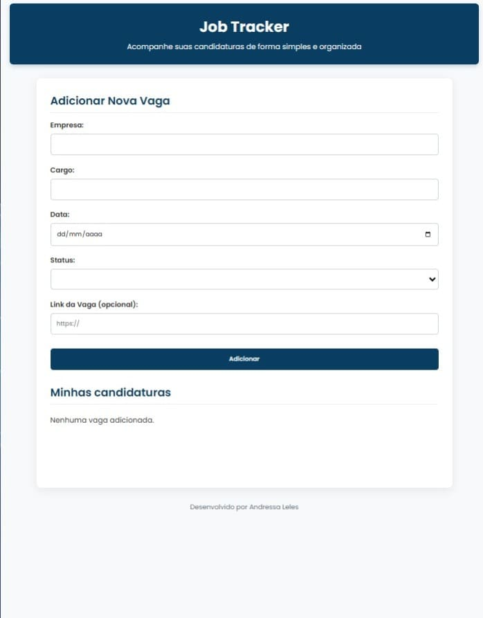
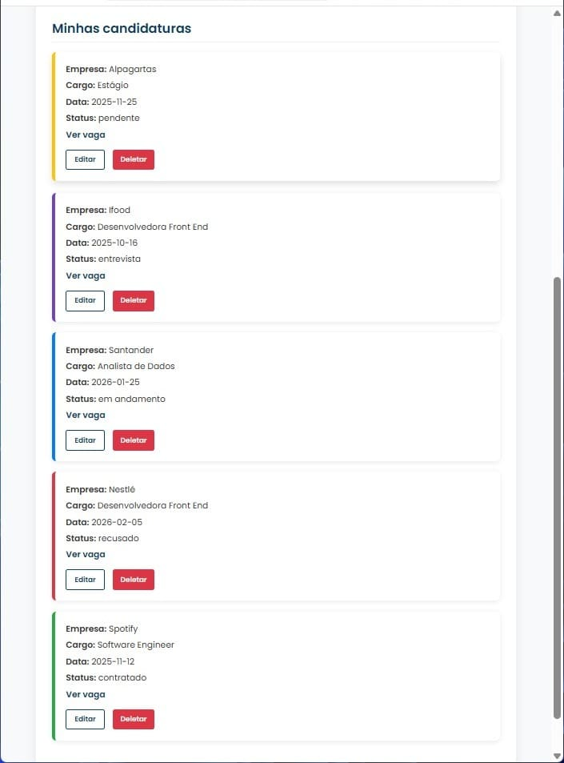

# Minhas Vagas 🚀

 

---

# 💼 Controle de Candidaturas

Um projeto simples e funcional para **organizar candidaturas de vagas de emprego**.  
Você pode adicionar, editar e excluir vagas, além de salvar todas as informações automaticamente no **LocalStorage**, garantindo que seus dados permaneçam mesmo após fechar a página.

---

## 🖼️ Demonstração

### 📸 **Print do projeto**

### 🎥 **Vídeo mostrando o funcionamento**
📱 Assista ao vídeo demonstrativo [clicando aqui](

https://github.com/user-attachments/assets/c1e58072-0995-4ae3-be36-38af8261bea8

)  

---

## ⚙️ Funcionalidades

✅ Adicionar novas vagas  
✅ Editar informações de uma candidatura  
✅ Excluir vagas da lista  
✅ Cores automáticas de acordo com o status  
✅ Armazenamento no **LocalStorage** (não perde os dados ao atualizar)  
✅ Interface simples e intuitiva

---

## 🧠 Tecnologias usadas

- **HTML5**
- **CSS3**
- **JavaScript (DOM + LocalStorage)**

---

💡 Melhorias futuras

🔹 Adicionar campo de observações sobre cada vaga
🔹 Filtro por status
🔹 Integração com banco de dados (versão futura)

✨ Desenvolvido por

Andressa Leles Serafim
📍 São Paulo/SP
📧 leles.andressa@gmail.com

🔗 LinkedIn [www.linkedin.com/in/andressa-leles]

